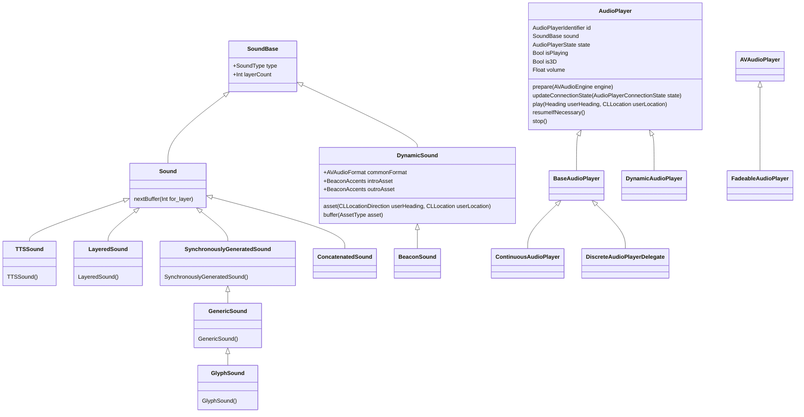

# Audio API for Soundscape
This document aims to describe the API for a library that can be exposed to the main Kotlin code in the Soundscape app. On Android this library will be in C++ so that it can directly call the Oboe and Steam Audio libraries which allows positioning of audio within a 3D space with HRTF.

## iOS Soundscape audio classes
The iOS app has a host of audio classes to support playback of beacons, text to speech and other sounds.



* **GlyphSound** are short audio files with specific meaning to the user e.g. app going offline/online, or entering/leaving a waypoint. I find them fairly indistinguishable, but perhaps with use and practice their meaning becomes obvious.
* **LayeredSound** seems to be for mixing sounds together. Each layer can have its own EQ parameters defined. 
* **ConcatenatedSound** simply joins sounds together to be played one after the other.
* **BeaconSound** vary with the user heading/location.

The classes can be user together to build complex sounds. An example playback from the Swift code is:


```
// Create a GlyphSound of the type poiSense:
let earcon = GlyphSound(.poiSense, compass: direction)

// Create a Text to Speech sound
let tts = TTSSound(approach, compass: direction)
            
// Concatenate them
let ttsSound = ConcatenatedSound(earcon, tts)

// And layer with a travelEnd sound
let layered = LayeredSound(ttsSound, GlyphSound(.travelEnd, compass: direction))
```

## Audio Engine Kotlin classes

There's [a great video](https://www.youtube.com/watch?v=Zwmhp7W6K6E) showing how to map Kotlin classes over to C++. The Kotlin class simply has a `long` which is the pointer to the C++ object and then this is passed into C wrapper functions which forward calls on to the C++ objects. The other useful bit is the `synchronized` keyword and the way that the Kotlin member functions are defined. With this knowledge we can then simply design Kotlin classes for the audio engine. The current classes we have in C++ from the proof of concept are:

<div class="mermaid">
classDiagram

    class BeaconBuffer{
        +void * m_pBuffer;
        +unsigned int m_BufferSize;

        BeaconBuffer(const std::string &filename)
        readData(void *data, unsigned int datalen, unsigned long pos)
        unsigned int GetBufferSize()    
    }
    
    class BeaconBufferGroup{
        BeaconBufferGroup()
        unsigned int pcmReadCallback(float *outMono, int numFrames)
        +vector BeaconBuffer m_BeaconBuffers // Buffers for different headings
        +unsigned int m_CurrentBuffer // Which buffer is currently playing
    }

    class BeaconAudioSource{
        void UpdateGeometry(double degrees_off_axis, double distance)
    }

    class TtsAudioSource{
        TtsAudioSource(int tts_socket)
        unsigned int pcmReadCallback(float *outMono, int numFrames)
        +int m_TtsSocket
    }

    class PositionedAudio{
        PositionedAudio(AudioEngine *engine, double latitude, double longitude)
        UpdateGeometry(double heading, double latitude, double longitude)
        virtual void CreateAudioSource()
        +BeaconAudioSource m_AudioSource
        +double m_Latitude
        +double m_Longitude
        AudioEngine *m_pEngine
    }
    
    class AudioEngine {
        void UpdateGeometry(double listenerLatitude, double listenerLongitude, double listenerHeading);
        void SetBeaconType(int beaconType);
        const BeaconDescriptor *GetBeaconDescriptor() const;

        void AddBeacon(PositionedAudio *beacon);
        void RemoveBeacon(PositionedAudio *beacon);

        +std::recursive_mutex m_BeaconsMutex
        +std::set<PositionedAudio *> m_Beacons
    }

    class Beacon{
        void CreateAudioSource()
    }

    class TextToSpeech{
        void CreateAudioSource()
    }
    PositionedAudio *-- BeaconAudioSource
    BeaconBufferGroup *-- BeaconBuffer
    BeaconAudioSource <-- TtsAudioSource
    BeaconAudioSource <-- BeaconBufferGroup
    PositionedAudio <-- Beacon
    PositionedAudio <-- TextToSpeech
    AudioEngine *-- PositionedAudio
</div>

The only thing that Kotlin needs to be able to do is create and destroy Beacons. An `AudioEngine` class to wrap this behaviour up with audio initialization and destruction makes sense.

```
interface AudioEngine {
    fun createBeacon(latitude: Double, longitude: Double) : Long
    fun createTextToSpeech(latitude: Double, longitude: Double, text: String) : Long
    fun updateGeometry(listenerLatitude: Double, listenerLongitude: Double, listenerHeading: Double)
    fun setBeaconType(beaconType: Int)
}
```
