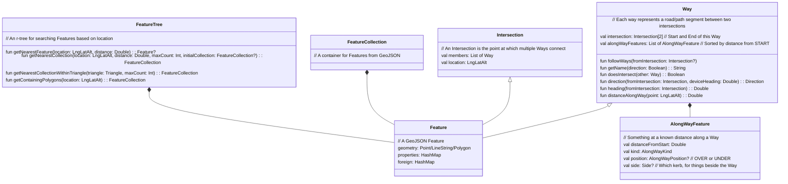
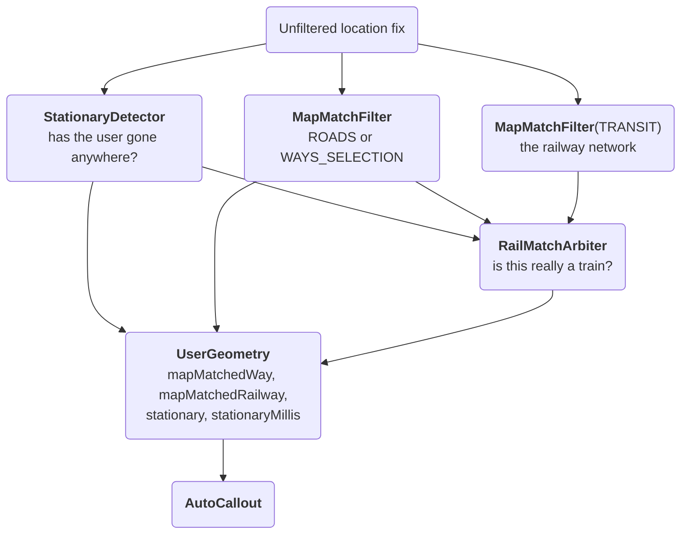

## GeoEngine introduction
The GeoEngine module takes care of parsing map tile data and making that data available to the rest of the app for generating audio callouts and some UI. The classes at the bottom levl are based around GeoJSON objects as per https://en.wikipedia.org/wiki/GeoJSON. Originally, the app was parsing GeoJSON from the soundscape-backend server and this was the natural result. However, now that we've switched to parsing Mapbox Vector Tiles the use of GeoJSON classes is somewhat legacy, though it does ease debugging as it's easy to output GeoJSON and render it on top of other maps e.g. using [geojson.io](https://geojson.io) . Here's a simplified view of the basic classes involved:



Features are points, lines or polygons along with some metadata describing what they are. We construct these based on the Mapbox Vector Tile contents and then divide them up into separate searchable FeatureTrees depending on the type of feature they are.

## Parsing the MVT (MapBox Vector Tiles)
Each MVT tile is processed layer by layer creating Features for all of the points that we are interested in. The main layers of interest are the POI which contains points and polygons for all of the various points of interest, and the transportation layers which contains roads and paths. We parse the `water` and `waterway` layers only for named lakes/reservoirs and named rivers/burns, and don't currently parse other layers (e.g. groundcover), though we may add some of those in future if we want to use that data.
After the initial parsing, some post-processing is done on the roads with the aim of:

* Finding Intersections so that we can call them out.
* Creating a Way for each segment of road/path between Intersections. Many of these will contain the same metadata because the original road/path in the tile stretched across multiple intersections.

The `transportation` layer carries railways as well as roads — the classes `rail` and `transit` — and those are built into a second, separate network of Ways and Intersections. See [Rail map matching](#rail-map-matching).

## The TileGrid
At any time the app is working on a 2x2 grid of tiles. After parsing each tile independently, Ways which cross the tile boundaries need joining together, as do Polygons. The result is a set of FeatureCollections which cover the whole grid. The post processing on the grid is then:

* Categorising POIs into the same super categories as were present in iOS e.g. landmark, safety, mobility etc.
* The FeatureCollection for each category is then used to create a FeatureTree. That enables fast searching to find the nearest Feature, be that roads, intersections or POIs.
* Attaching crossings, transit stops and railway stops to the Ways they belong to (see below). Some of this can only be done here, on the merged grid, rather than per tile.
* Confect names for un-named ways (see below)

There is a second grid alongside the main one, `settlementGrid`, at zoom 12 over a 3x3 area. Towns and cities have to be visible from much further away than the main grid reaches, and they're only needed for travel callouts, so they get their own coarser grid rather than enlarging the main one.

## Use the FeatureTrees
Searching the FeatureTrees is reasonably efficient, though multiple searches should be avoided due to CPU performance costs. They are very useful when generating the audio callouts. For nearby POI, `getNearestCollection` can be called to find POI within a certain distance from the user location. The alternative `getNearestCollectionWithinTriangle` can be used to search within a triangle rather than within a circle. If we do this with a `Triangle` created with one corner at the user location we can do a 'field-of-view' search. This also works for searching roads and paths.

## Traverse the Ways and Intersections
Once code has an Intersection or a Way it can follow Ways across the map tiles. Each Way has a reference to Intersections at either end and each Intersection contains a list of all of the Ways which comprise it. This traversal is very efficient and makes these features straightforward:

* Street Preview. It's possible to implement the Way traversal used by Street Preview using just FeatureTrees, but it's far more efficient to use Ways and Intersections.
* Name confection. This is how we add context to un-named paths and service roads. For each intersection that contains at least one named way (e.g. `"Roselea Drive"` rather than just `"path"`) we add a tag to each un-named way that joins that intersection. The tag will either be `"destination:forward"` or `"destination:backward"` depending on which way the Way runs (in to or out of the intersection). These can be used when describing paths later when approaching intersections e.g. `"Path to Roselea Drive"` when travelling one way, or `"Path to Mosswell Road"` when travelling in the opposite direction. We also add tags indicating dead-ends which is a useful way of filtering callouts e.g. don't call out un-named dead-ends - there are a lot of dead-end service roads in my local area, and calling them adds little context.

  Two further confections are done lazily, per Way, the first time something needs to describe it (they need FeatureTree searches, so doing the whole grid up front is too slow). A pavement is named after the road it runs beside, e.g. `"Pavement next to Clober Road"`, and a way which follows a named river, burn or loch for a meaningful distance is named after the water, e.g. `"Path next to Allander Water"` or `"Path next to Craigmaddie Reservoir"`. The water confection requires at least 80m of the way (or all of it, if it's shorter) to lie within 25m of the same water, which is what distinguishes a path that follows a river from a road that merely crosses it.

## Features along a Way
Some things are not best found by searching near the user. "Which bus stop have I just gone past?" answered by a FeatureTree search of everything near the path travelled since the last fix can't tell the stop on this road from one on the next street over, and can't tell the two kerbs apart without comparing bearings. "Which river am I about to cross?" is worse: at 70mph the answer has to be known before the bridge, and a radius search large enough to find it also finds every other river in the neighbourhood.

So a set of point features are attached to the `Way` they belong to, once, when the grid is built. `Way.alongWayFeatures` is a list of `AlongWayFeature`, kept sorted by `distanceFromStart` — metres from that Way's START intersection, measured along its own geometry — so that "what's next along this road?" is a lookup rather than a geographic search. It's a sorted list rather than a map keyed by distance because commonMain has no sorted-map type and two features can legitimately sit at the same distance. Ways are the pieces of road between intersections, so these lists are short and a linear scan costs nothing.

`AlongWayKind` says what each one is:

| Kind | What it is | Recorded on |
| --- | --- | --- |
| `WATERWAY_CROSSING` | A named river or canal the Way crosses | The road or path |
| `RAILWAY_CROSSING` | A railway the Way crosses | The road or path |
| `ROAD_CROSSING` | The mirror of the above — a road that crosses this railway | The railway |
| `TRANSIT_STOP` | A bus or tram stop beside the road it serves | The road |
| `RAILWAY_STOP` | A point on the line at which trains stop | The railway |

Two fields qualify a feature. `position` is `OVER` or `UNDER` — deliberately the *user's* relationship to the thing crossed and never a raw OSM `brunnel` value, because the evidence arrives from either side and the two invert each other: a road tagged `brunnel=bridge` is over the river, whereas a waterway tagged `brunnel=bridge` is an aqueduct, so the road below goes under. `side` is which kerb something beside the Way sits on, relative to travelling from START to END, which is what tells a stop serving this direction of travel from the one across the street serving the other.

`RAILWAY_CROSSING` and `ROAD_CROSSING` are written as a mirrored pair from the same geometric test, so that a train passenger's callout is a lookup on the line being ridden rather than a search for roads that happen to be nearby. The railway's copy has the position already inverted.

### Attaching them
The hard part is picking the right Way. `Way.distanceAlongWay` projects a point onto the Way's geometry, and `Ruler.distanceToLineString` clamps to the line's extent — so a point that isn't really on this Way comes back as `0.0` or `length` rather than as a position past either end, and the along-way queries would read that clamped value as a real position. Every attach step therefore has to choose the Way the point genuinely lies on first.

* **Waterway crossings** are found per tile at parse time by `extractCrossings`, keyed by the crossing road's OSM id, then hung on Ways by `WayGenerator.attachCrossings` after `generateWays` has split that road at its intersections. It attaches to *every* piece within 30m of the crossing point, not just the nearest: OSM splits a road at a bridge and again at anything else along it, so a bridge is routinely several Ways sharing one osmId — Drymen Road over the Milngavie Branch is two — and a driver can enter by any of them. Recording it against only the nearest piece leaves the others with nothing to find, and the along-way walk won't cross the junction between them to reach it. The bound matters too, since one osmId can run the length of a street and a distant piece would take the crossing at a clamped distance and announce at the wrong moment. Only `river` and `canal` are significant enough to announce; a stream is often a culverted ditch under a road.
* **Railway crossings** can't be resolved at tile-parse time at all, and are done later against the merged grid by `GridState.attachRailwayCrossings`. A road and a railway can straddle an MVT tile boundary right at the point they cross, with each tile's geometry independently clipped there, so the two clipped pieces can fail to touch within either tile even though the real crossing is genuine. Candidates are shortlisted with `getNearbyLine` against the railway *line* rather than its vertices, because a viaduct is routinely a single two-point way whose endpoints sit well back from the road it crosses (the Castlecary viaduct is 172m long with its endpoints 47m and 119m from the M80, so a per-vertex query finds nothing at all). A genuine grade-separated crossing needs a `brunnel` on one side or the other — OSM only tags the structure that was actually built, so a viaduct over an untagged road is tagged on the railway, and the road is then inferred to go under. A railway that is itself in a tunnel is skipped, since a road bridge over the horizontal projection of a deep tunnel isn't crossing anything a traveller can perceive.
* **Transit stops** are attached by `attachTransitStopsToWays` to the strictly nearest `Way` within 20m, searching `TreeId.ROADS` rather than `ROADS_AND_PATHS` because a stop belongs to the street, not to the pavement running alongside it. The kerb question is settled here, once, where the geometry is to hand.
* **Railway stops** are covered under [Rail map matching](#rail-map-matching).

Nothing splits a Way at an attached point. The one place that does divide `alongWayFeatures` between two halves, re-basing the second half's distances, is `createTemporaryIntersectionAndWays`, used by routing.

### Walking the list
`utils/AlongWay.kt` holds the query side. A `WayCursor` is a position on a Way — the Way, a distance from START, and a direction — and `nextAlongWayFeature` / `forEachAlongWayFeatureAhead` walk outwards from it through the graph, crossing into neighbouring Ways via their shared `Intersection`s. Since a single road is split into many Ways, at every junction *and* at every tile boundary, `WayContinuation` decides how far the walk is willing to follow:

* `STRAIGHT_ON` goes through intersections joining exactly two Ways and stops at any real junction. It's the honest answer for something the user is about to arrive at, since past a junction there's no single road ahead to be looking down.
* `SAME_ROAD` goes through junctions too, taking whichever Way continues the same road by name or ref. Anything that needs to see a useful distance up a road needs this — an urban main road has a side street every fifty metres, so `STRAIGHT_ON` stops almost immediately and a hundred-metre lookahead would never reach anything.

Tile boundaries are handled by the same machinery that joins the grid. A vertex exactly on a tile edge becomes a `TILE_EDGE` intersection rather than a regular one, and `joinTileEdgeIntersections` links matching pairs within 1m using a synthetic zero-length `JOINER` Way. The walk treats a `JOINER` as continuing the same road, so a lookahead crosses a tile seam without noticing it. Road and rail graphs are joined separately, so that a level crossing can't fuse the two networks into one.

### Pedestrian crossings are *not* one of these
Worth stating plainly, because the naming invites the opposite assumption: `highway=crossing` — the pedestrian crossing — has nothing to do with `AlongWayFeature`. Crossings come from the `transportation` layer (they're a custom addition to our tiles, carrying dropped-kerb and tactile-paving metadata), go into `TreeId.CROSSINGS`, are folded into `POIS` and classified as `MOBILITY`, and are announced by the ordinary nearby-POI callout from a field-of-view FeatureTree search. Unmarked crossings with no tactile paving are discarded at parse time.

They're also deliberately kept *out* of the road trees — `generateWays` drops `crossing` and `bus_stop` Ways — though they remain in `Intersection.members`, and `IntersectionUtils` filters out intersections made mostly of pavements and crossings so that a crossing doesn't get described as a junction. Where the user is map-matched onto a pavement or a crossing, the parent road is substituted using the confected `pavement` property. There is no callout today that says an intersection *has* a crossing, and `railway=level_crossing` is not implemented at all — only grade-separated rail crossings are detected.

## Filters
The classes in `geoengine/filters/` sit between raw sensor readings and the rest of the engine: a Kalman filter that smooths location and heading, the map-matching filter that decides which road or path the user is actually on, a detector that decides whether they are standing still, and an arbiter that decides whether they are on a train.

`GeoEngine` runs them in a fixed order on every location update, and the order matters because each reads the one before it:



They are all fed the **unfiltered** location flow rather than the Kalman-filtered one. The stationary detector needs the jitter that the Kalman filter exists to smooth away, and the matchers do their own smoothing over a window of fixes.

`MvtTileTest.testMovingGrid` replays a recorded GPX through this same pipeline and writes a transcript of the resulting callouts, which is how most of the behaviour below is regression-tested. It mirrors the ordering above by hand, and there's a comment in `GeoEngine` saying so — if the two drift apart, the replays silently stop reflecting what the app does.

### KalmanFilter
`KalmanFilter` is a general N-dimensional Kalman filter parameterised by a single `filterSigma` that controls how quickly the filter's confidence in its previous estimate decays over time:

```kotlin
open class KalmanFilter(filterSigma : Double = 9.0, private val dimensions : Int = 2)
class KalmanLocationFilter(filterSigma : Double = 6.0) : KalmanFilter(filterSigma, 2)
class KalmanHeadingFilter (filterSigma : Double = 9.0) : KalmanFilter(filterSigma, 1)
```

Each `process()` call mixes a new measurement with the previous estimate. The mixing weight (the Kalman gain) is driven by two variances:

* The measurement variance, taken from the OS-reported accuracy (clamped to a small minimum to avoid divide-by-zero).
* The covariance of the current estimate, which grows linearly with elapsed time (`covariance += interval * sigma * sigma`) to represent the decay in confidence between updates.

The result is that high-accuracy fixes pull the estimate strongly toward the new measurement, while low-accuracy fixes barely move it. Two subclasses adapt the base filter to specific use cases:


* `KalmanLocationFilter` runs over `[longitude, latitude]` and is applied to every `FusedLocationProvider` update before it reaches the rest of the app. Its output is the location seen on `LocationProvider.filteredLocationFlow`, which is what the `GeoEngine`, `RoutePlayer` and audio callouts consume.
* `KalmanHeadingFilter` is a 1-D variant used for heading smoothing.

### MapMatchFilter
`MapMatchFilter` is what makes intersection callouts describe the correct approach road. Pedestrian map-matching is harder than car sat-nav map-matching because users can walk in any direction, cross open space, and switch between roads, pavements and paths at will. We are not trying to match a completed GPS trace; we have to decide road membership live, on every new location.

The algorithm is based on the paper [*An Improved Map-Matching Technique Based on the Fréchet Distance Approach for Pedestrian Navigation Services* by Yoonsik Bang, Jiyoung Kim and Kiyun Yu](https://pmc.ncbi.nlm.nih.gov/articles/PMC5087552/), with our own approach for generating the candidate paths on which the algorithm runs. The paper doesn't cover candidate generation, so the bulk of our `MapMatchFilter` code is concerned with maintaining a live list of candidates.

Key types:

* **`RoadFollower`** — one candidate path. Holds an ordered list of `Way`s, an `IndexedLineString` view of them (so a point on the line can be mapped back to its source `Way` and original direction), a queue of recent Fréchet distances, and a state from `RoadFollowerState { LOCKED, UNLOCKED, ANGLED_AWAY, DIRECTION_CHANGED, DISTANT }`. `update()` returns a `RoadFollowerStatus(frechetAverage, state)` each tick.
* **`IndexedLineString`** — a `LineString` built by concatenating the geometries of a route of `Way`s. It tracks which segment belongs to which `Way` and whether the `Way` was reversed during concatenation, so that the per-point heading can be reported in the original `Way`'s direction. It also computes a hash code from its coordinates so identical followers can be de-duplicated.
* **`MapMatchFilter`** — the orchestrator. Holds the live `followerList`, the currently selected `matchedFollower`, and the last reported `matchedWay`/`matchedLocation`.

On every new location:

1. `extendFollowerList` queries the `FeatureTree` for roads within 20 m. For each new road we either extend an existing follower into it (when it connects at an intersection of the route's start/end) or spawn a new follower. Dead-end ways shorter than 20 m are not pursued. The list is de-duplicated by `IndexedLineString` hash.
2. Each follower's `update()` computes the average Fréchet distance over a sliding window (`FRECHET_QUEUE_SIZE = 12`) between the user's recent track and the follower's line. Followers that are too far away, point the wrong way, or whose direction has just flipped are marked `DISTANT` / `ANGLED_AWAY` / `DIRECTION_CHANGED`. The remainder are candidates.
3. The follower with the lowest Fréchet average becomes the `matchedFollower` and the closest point on its line becomes `matchedLocation`. The corresponding `Way` is reported as `matchedWay` — that is the road that callouts will describe as the "current" road, and the basis on which intersection approach directions are computed.

Which tree is searched depends on the instance and on speed. `matchTree()` returns the `networkTree` the filter was constructed with if there is one, and otherwise picks `ROADS` at vehicle speed or `WAYS_SELECTION` (roads *and* paths) below it — a driver is never on a footpath. Some follower-selection heuristics (letting a follower with partial history compete, plus switch hysteresis and a raw-distance override) are gated to vehicle speed as well: they were diagnosed from driving replays, where the search radius grows large enough to span a nearby parallel or service road, and left unconditional they also changed walking-speed callouts.

`isMatchConfident` is tracked separately from having a match at all, with `GRACE_TICKS_AFTER_LOSING_CONFIDENCE` of tolerance, so that a brief wobble doesn't look like the user leaving the road.

The map-matched location is what user-facing callouts use; the raw `FusedLocationProvider` location is still available on `LocationProvider.locationFlow` for callers (mainly the UI map) that prefer to render the unfiltered point, and the Kalman-filtered one on `filteredLocationFlow`.

### StationaryDetector
Instantaneous GPS speed cannot tell standing still from walking. Measured over four recorded journeys, a stationary user's median GPS speed across a minute is 1.33 m/s against 1.39 m/s for someone walking — the best threshold that exists still misreads 22% of stationary windows and 33% of walking ones, and the old `speed > 0.2` test was true for *every* stationary window measured. That is how standing on the concourse at Glasgow Queen Street came to be read as walking about.

`StationaryDetector` asks a different question: not how fast the GPS says the user is going, but whether they have actually gone anywhere. Net displacement across a window separates the two outright. It is also the more robust signal when the GPS is struggling — one 341-second spell on the Milngavie recording reported a speed of about zero throughout while the train actually covered two kilometres.

| Constant | Value | Why |
| --- | --- | --- |
| `windowMillis` | 30s | Over a minute the separation is cleanest (19.4m against 66.4m), but a minute is far too slow for the thing that needs this most — `RailMatchArbiter` gives up on a ride about five seconds after a train stops. 25s is the shortest length that still separates the two with no measured error; 30s is the shortest with a margin worth having (21.8m at the 90th percentile standing, against 34.6m at the 10th walking). |
| `stationaryMetres` | 25m | Sits in the gap: standing reaches 21.8m at p90 over 30s and 24.9m at its very worst, while walking starts at 34.6m. |
| `movingMetres` | 30m | Hysteresis, so a window sitting on the boundary doesn't flip back and forth. |
| `usableAccuracyMetres` | 25m | Deliberately stricter than the 50m gate that asks which street the user is on — a 50m fix answers that and says nothing about whether they moved twenty metres. A fix with no accuracy at all is admitted, since that's a synthesized location (Street Preview, a hand-written GPX) rather than a bad one. |
| `minimumSamples` | 5 | Two fixes a minute apart can be a minute of standing still or a minute of walking out and back. |

There is also a fast escape from a stationary spell, based on Android's own opinion of its GPS course. Of the fixes recorded while genuinely standing still, 2% carried a course rated accurate to better than 45 degrees, against 80% of those recorded while walking — so two such fixes in the last six end the spell in about six seconds, rather than the twenty-odd it takes to walk thirty metres. It is only ever an escape and never an entry, so the worst a wrong answer can do is behave the way the app did before any of this. When it fires it clears the window, because the evidence that the user was still is now stale.

The course flag must be derived from the GPS course and never from the compass or the head tracker: somebody standing still holding the phone up to read the screen produces a perfectly steady compass heading while going nowhere. `GeoEngine` builds it from `hasBearing && hasBearingAccuracy && bearingAccuracyDegrees < 45.0`.

The verdict is a plain Boolean, and reports false until the window has filled. Every consumer treats "not stationary" as "carry on as before", so an undecided window is automatically a no-op. It reaches the rest of the engine as `UserGeometry.stationary`, alongside `stationaryMillis` — a running total of *observed* still time, which callout code subtracts so that its windows don't expire while nothing was happening.

## Rail map matching
Railways form a second network, entirely separate from the road one. They come from the same OpenMapTiles `transportation` layer as roads, but the classes `rail` and `transit` are routed to a second `WayGenerator` and end up in their own `TreeId.TRANSIT` tree. They get `Intersection`s and `Way`s built in the same way and are stitched across tile boundaries by the same code, but they are kept out of the intersection callout collection (a railway junction isn't something to announce) and out of `POIS`, and no name confection is run on them — an unnamed line is described generically as "train" or "tram".

Tunnels and subway segments are deliberately kept in the tree, because they are what keeps a train matched while it's underground with no GPS at all. The tunnel-mouth node is added twice and becomes an `Intersection`, joining the surface and tunnel Ways.

### Two matchers, one filter class
There is no rail-specific filter class and no rail `RoadFollower` variant. `MapMatchFilter` takes a network parameter and `GeoEngine` runs two instances:

```kotlin
private var mapMatchFilter = MapMatchFilter()
private var railMapMatchFilter = MapMatchFilter(networkTree = TreeId.TRANSIT)
```

Each instance's `followerList` only ever holds `Way`s from one network, which is the point: roads and railways are separate connectivity graphs and a follower can't meaningfully run off one onto the other. The rail instance always gets the driving-tuned follower selection, since a train is always moving fast and the road filter's vehicle-mode flag isn't meaningful for it.

### RailMatchArbiter
A confident lock onto a railway is **not** on its own a safe proxy for being on a train, however much it looks like one. Motorways are routinely built alongside railway lines for kilometres at a time: the M90 past Winchburgh runs 35-70m from the Winchburgh Chord for about a minute at 70mph, which used to be enough for a driver to be told "On Winchburgh Chord". The two matchers can't see each other, so `RailMatchArbiter` weighs the railway match against the road match from the same update and decides whether there's a ride in progress. Its verdict is published as `UserGeometry.mapMatchedRailway`.

Acquiring a ride is deliberately harder than keeping one. All of the following must hold for `acquireTicks` (10) consecutive updates:

* There is a confident rail match.
* The line is not in a tunnel. A tunnel may *keep* a ride going but can never *start* one — otherwise driving along Kent Road over the Charing Cross tunnel, or up Byres Road over the Glasgow Subway, would start one. A metro ride is only picked up where the line surfaces.
* Speed is above `VEHICLE_SPEED_THRESHOLD_MPS`. A ride starts at train speed.
* `railBeatsRoad()` — the rail match is nearer than the road match, or the road match isn't confident.

Holding a ride runs a different test, `railStillExplainsThePosition()`, which passes if the line is in a tunnel, **or** speed is above the vehicle threshold, **or** the user is stationary (with no time limit at all), **or** there's no stop within reach to have got off at, **or** the fix is within `onTheLineDistanceMetres` (15m) of the line. Failing updates are tolerated for `releaseTicks` (5) — or `releaseTicksAtAStop` (35) when a stop is within `stopWithinReachMetres` (250m) measured *along the rails*, which is long enough for the stationary detector's 30-second window to fill and vote. Without that, the arbiter ended the ride at every station.

### Three notions of being on a train
These are easy to conflate, and all three are used:

* **`UserGeometry.mapMatchedRailway != null`** — the arbiter's raw lock. Used to refresh the sticky windows, because it survives a station dwell.
* **`UserGeometry.probablyOnTrain()`** — `(mapMatchedRailway != null) && (inVehicle() || stationary)`. The lock can outlive the ride by design: walking up a platform stays within 15m of the line, and a concourse often has no confident road match to weigh against it. Somebody neither travelling at vehicle speed nor standing where the train stopped is walking, and walking out of a station is not being on a train. The `|| stationary` half is equally deliberate — requiring `inVehicle()` alone made this false throughout every dwell, and the recorded dwells run to 340 seconds, so the callouts that depend on knowing the user is on a train switched off at exactly the moment a passenger most wants them.
* **`AutoCallout.recentlyOnTrain()`** — a 60-second sticky window over the raw lock.

### Stations
Stations are matched from the line being ridden, not by searching for POIs nearby. OSM's `railway=stop` is a node on the line itself rather than a place beside the tracks, so the line knows its own stops — which matters where several lines run close together and a train passes a station without calling at it.

`attachRailwayStopsToWays` hangs each `railway=stop` node on the nearest `TRANSIT` Way as a `RAILWAY_STOP`, with a 2m tolerance that only absorbs tile quantisation. Where an area has no stop nodes at all, `attachStationsAsRailwayStops` falls back to attaching station POIs within 100m of the line — decided per station, so a line that already has stop nodes is left alone, and excluding subway lines and `building=train_station` footprints.

The callout side then walks the line with `SAME_ROAD` continuation looking for the next named stop: within 200m, looking both ways, it says "At Hyndland"; within 500m looking only forwards, "Approaching Partick". An "At" also records the station in `LastStationTracker`, which is what lets a later callout append ", 3 miles since Partick".

## Travel mode
"Travel mode" is what the app does when the user is in a car, bus or train rather than on foot. Previously Soundscape carried on describing the immediate surroundings, which at speed meant a stream of things already gone past.

There is **no travel mode enum and no setting that turns it on**. It's a set of derived predicates on `UserGeometry`, re-evaluated on every location update, plus sticky windows in `AutoCallout` that smooth them out:

* `inVehicle()` is a bare speed test, `speed > VEHICLE_SPEED_THRESHOLD_MPS` (5 m/s, about 10mph). Android's Activity Recognition proved unreliable, so speed is used instead. It's instantaneous and unsmoothed, so a vehicle stopped at a junction is momentarily not in a vehicle — every consumer that cares pairs it with `recentlyInVehicle()`.
* `inMotion()` is `(speed > 0.2) && !stationary`.
* `probablyOnTrain()` is described [above](#three-notions-of-being-on-a-train).

Being in a vehicle changes ranges as well as content: `transform()` multiplies search, trigger and proximity ranges by six, so that things are announced far enough ahead to be useful at speed. Above `BIG_UNIT_SPEED_THRESHOLD_MPS` (13.4 m/s, 30mph) distances are spoken in kilometres or miles however short they are — metre precision is meaningless when you're covering 13m a second, and the extra syllables cost time that matters far more at speed.

### The callout builders
The pedestrian callouts (nearby POIs, intersections) are suppressed while travelling and a parallel set of builders in `AutoCallout` takes over. `updateLocation` runs them in a fixed order and *merges* the results: the first non-null is the primary callout, and the rest have their strings appended to it.

| Builder | Gate |
| --- | --- |
| `buildCalloutForRoadSense` | in a vehicle; also owns the sticky-window and station bookkeeping |
| `buildCalloutForVehicleLandmark` | in a vehicle, not on a train — parks, hospitals, stadiums, shopping centres as they're passed |
| `buildCalloutForVehicleTransitStop` | in or recently in a vehicle, not on a train |
| `buildCalloutForVehicleCrossing` | in a vehicle, on a road rather than a train |
| `buildCalloutForTrainCrossing` | on a train |
| `buildCalloutForWalkingCrossing` | on foot |
| `buildCalloutForTunnel` | any mode; prefers the railway Way when there is one |

Two traps for anyone editing these. `buildCalloutForRoadSense` has side effects — the sticky windows and the last-station tracker — which run *before* its own preference gate and throttle, so it has to be called on every update even when its callouts are switched off. And the landmark and transit-stop builders add to their dedup histories eagerly, because they're usually merged into another callout's strings and would otherwise never be recorded.

Crossings are announced from the `AlongWayFeature` lists described [above](#features-along-a-way). The lookahead is three seconds of travel, clamped to between 25m and 150m, plus a backward "sweep window" covering the ground travelled since the last fix — capped at 1000m and at a 60-second gap, since beyond either the intervening ground wasn't necessarily travelled.

### The reverse geocode
The "where am I" text comes from `travellingReverseGeocodeName`, which tries in order:

1. **Station**, on a train.
2. **Highway junctions and exits**, from the `HIGHWAY_JUNCTIONS` tree — `subclass=junction` points in the `transportation_name` layer, carrying `ref`, `name` and `class`. Junctions on motorway, trunk and primary roads are always called; junctions on smaller classes only when nothing else has been said for 90 seconds, so a quiet drive still gets context without a residential junction every fifty metres. An unknown class is never called out.
3. **Inside a POI**, when the user is within one.
4. **Settlements passing by**. The phrasing depends on the angle between the direction of travel and the bearing to the settlement: within 45° it's "towards X, N away", beyond 135° "away from X", otherwise "near X". Cities skip the directional form. Which tier is worth mentioning depends on the road — on a motorway only towns and cities, on a trunk road villages and up.
5. **"since {station}"**, on a train, appended to a settlement — deliberately never standalone.
6. Road-only, settlement-only and "Near X" fallbacks.

Roads are named by number as well as name where they have one ("A81 (Glasgow Road)"), and the road phrase reads "Travelling north along M8".

Settlements come from `settlementGrid`, a second `ProtomapsGridState` at zoom 12 over a 3x3 grid, held alongside the main one. It's separate because towns and cities have to be visible much further away than the main grid's zoom-14 2x2 reaches.

### Sticky windows and dedup
Two 60-second sticky windows smooth the instantaneous predicates: `recentlyInVehicle()` and `recentlyOnTrain()`. Both are refreshed from the **ride** rather than from speed alone — from `inVehicle() || (mapMatchedRailway != null)`, using the arbiter's raw lock rather than `probablyOnTrain()`, because braking into Falkirk High ate the window under the speed test.

`discountUninformativeTime` then freezes both windows for time in which nothing could have been observed: time the engine was blind (`unobservedMillis`, capped at five minutes) and time the user was seen standing still (`stationaryMillis`, deliberately uncapped). Without it, a long tunnel or a 340-second station dwell would expire a window that ought to have survived it. The deltas are tracked rather than read directly, because `updateLocation` is skipped whenever the audio engine is busy.

Dedup is handled by `TrackedCallout` and `CalloutHistory`. Two callouts match if their comparable text matches and, where they have a location, they're within a match radius — 10m by default, 20m for generic POIs, 200m for adjacent structures so that a multi-deck bridge isn't announced twice. Entries expire by age and by distance from where the callout was made. What the keys are chosen to be matters more than the mechanism:

* A numbered road dedups on its ref alone, so the A81 changing street name or passing through another village doesn't re-announce it.
* A junction callout also claims the plain road key as an `extraDedupText`, asymmetrically, so "still on the M80" can't follow immediately after a junction callout — but not the other way round.
* The train "since station" key is `"since {station}"` only; the settlement, the distance and the line name are all excluded, since the distance changes on every update.
* Direction of travel is excluded from every key, because a winding road would otherwise re-announce itself at every bend.

On top of dedup, `LocationUpdateFilter` rate-limits each kind of callout by elapsed time and distance moved; in a vehicle the interval is multiplied by four and the distance is scaled by speed.

## APIs
Most of the GeoEngine APIs use two pieces of data:

* `GridState` which contains all of the `FeatureTrees` for the current `TileGrid`
* `UserGeometry` which contains all of the information about the current user location, headings and map matched location. The heading calculations aim to match iOS which uses the phone heading, GPS travel heading as well as head tracking heading (not yet implemented on Android). It's possible to have no heading at all if the user isn't moving and the phone is locked and the phone is not held flat.

Beyond location and heading, `UserGeometry` carries the outputs of the filters above — `mapMatchedWay` and `mapMatchedLocation` from the road matcher, `mapMatchedRailway` from the rail arbiter, and `stationary`/`stationaryMillis` from the stationary detector — along with `unobservedMillis`, the running total of time during which fixes were arriving too inaccurate to place. Callout code that measures elapsed time subtracts the latter two so that its windows don't run out while nothing was being observed.

`cursorOn(way, fallbackHeading)` builds the `WayCursor` that the station and crossing lookaheads walk from. Note that it only uses the map-matched point when the Way asked about is the matched one; on a train the raw location is projected onto the railway instead, rather than carrying the *road* matcher's 35-70m offset onto the line.
