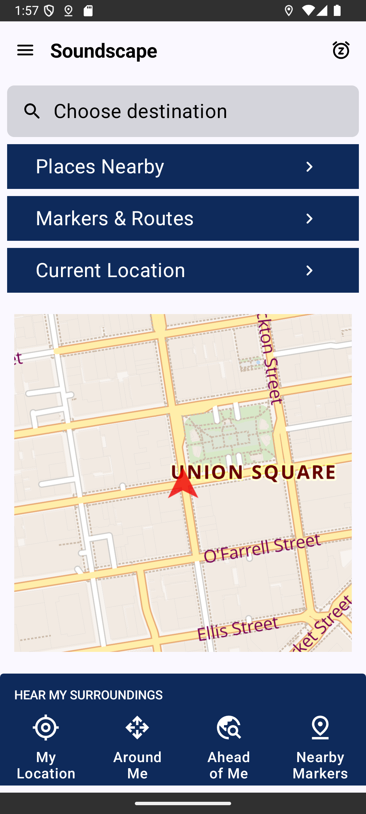

# How to easily test the Soundscape app
These instructions are aimed at an initial test of the Soundscape Android app with the following 
aims:

1. Check that it runs on a wide variety of phones
1. Have a larger number of users running it to spot things that we have missed
1. Test the audio callouts in different geographical locations

The app is a port of the Soundscape iOS app and the UI is designed to be pretty much the same.
Whilst we're interested in improving the UI in the long term, matching the iOS behaviour is the 
most important goal for this initial release.

We're going to use Slack for all initial feedback, here's the channel link:
[#soundscape-android-testing-feedback](https://scottishtecharmy.slack.com/archives/C08HJBFPN8N)

## Requirements
The app currently requires Android 11 (API 30 - see [https://apilevels.com/](https://apilevels.com/)). We are hoping to drop this to Android 9 with some more work, but for now we only support Android 11 and later.
We don't know of any other requirements, but that's one of the thing this testing should help us understand.

## Installing the app
Because it's currently in _Closed Testing_, to get access to the app you need added to a list 
on the PlayStore. Once added to the list, the app can be installed from here:

[https://play.google.com/store/apps/details?id=org.scottishtecharmy.soundscape](https://play.google.com/store/apps/details?id=org.scottishtecharmy.soundscape)

Follow the instructions there for how to download and install the app..

## Running the app the first time
The first time you run the Soundscape app you will see a series of onboarding screens which let 
you select various initial settings. US and UK English are currently the only languages fully 
supported by the app, though unless you are visually impaired all of the other languages should 
work well (we have some new [Talkback](https://support.google.
com/accessibility/android/answer/6283677?hl=en-GB) strings which are yet to be translated).

Things we're interested in on the initial screens:

* Is there any text on the screens that you are unable to read or where words are split across 
  lines?
* Do you just hear silence when you click the **Listen** button on the **Hear Your 
  Surroundings** page?
* Do you only hear silence when selecting the different beacon sounds on the **Choose an Audio 
  Beacon** page?

Please report any of these issues on the Slack channel.

## Main app operation
Now that you're past the onboarding screens, you shouldn't see them again and you should be on 
the main screen:

Soundscape will now continue to run in the background. To exit it, click on the top right corner 
to put the app to sleep, and then close the app (swipe up etc.).

Soundscape is designed to be used with headphones.

Things that should happen on the Home screen and we're interested if they do not:

* The map should show your current location with a red triangle. (There should be a map!)
* The red triangle on the map should rotate as you point the phone in different directions.
* Speech describing your surroundings should be heard when you click on each of the 4 buttons at 
  the bottom of the screen.

If you've got to this point and it all seems to be working, then you can move on to more 
detailed testing.

### Test 1 - Go for a walk
As you move around, Soundscape should periodically describe your location and call out any 
points of interest that you pass e.g. Shops, Bus Stops etc. We're interested if there's anything 
that doesn't sound right. The app will consume a little bit of data as it downloads maps as you 
move around, but in general those are fairly small (< 50kb for a 600m square bit of map). The 
map tiles are cached so they will generally only be downloaded once.

### Test 2 - Create a route and play it back
This uses a bit more of the UI, but once set up it should be fairly straightforward.
#### Create some Markers
Markers are points on the map which can be added together to make a route. Markers can be saved from
the Location Details screen, but there are many ways to get to that.
1. A long tap on the map on the home screen, or the map on the _Current Location_ screen will bring 
   up a Location Details page for that location.
1. The _Current Location_ button on the main screen brings up the Location Details for the 
   current location. The map there is scrollable and you can zoom in and out. It's possible to 
   save markers, move to a new point, long tap and save another marker.
1. The _Places Nearby_ button on the home screen shows nearby points that can be clicked on for 
   Location Details.
1. The search bar will bring up results which can be clicked on for Location Details.

Once saved, Markers appear in the screen that can be navigated from the _Markers and Routes_ 
button on the home screen. Once you have a number of Markers, you can create a route.

#### Create a route
1. With the _Routes_ tab of the _Markers and Routes_ screen selected, click on the + icon in the 
   top right. 
1. Type in a name for your route, and an optional description.
1. Click _Add Waypoints_ and add the Markers you've created. Select the markers in the order 
   that you want them to appear in the route and then click _Done_.
1. Click _Done_ again to save the route.

There should now be a route listed. Click on that and you can check that it's what you think it 
should be.

#### Play the route
Click _Start Route_ on the _Route Details_ screen to start an audio beacon playing at the first 
waypoint of the route. The audio beacon will sound from the direction of the waypoint from where 
you are. When you're using the Soundscape app and your phone is unlocked, the direction used is 
the direction that the phone is pointing in. You can lock your phone and put it in your bag and 
then it will start using the direction in which your walking. The sound of the beacon will be
different if you are walking towards it or away from it. If you stop moving and your phone is 
locked then any beacon will go quieter to indicate that there's no available direction data.

## Providing debug location trace
In release 0.0.71 we added a feature that provides useful data to us for debugging issues.  The app can now store up to an hour buffer of the user location recorded whilst the app is running. This feature is disabled by default, and even when enabled the data stays on the phone unless the user chooses to share it via interaction with the app. To use the feature:
1. Tap on the Menu hamburger in the top left, and then tap on "Settings" scroll to the bottom and you'll see the "Enable recording of travel" option. Click to enable/disable.
2. With the setting enabled, a new option appears in the Menu drawer below "About Soundscape" which is "Share recording of travel". If you want to share a GPX track you can click on that and you can then choose whether to use email/slack etc. to send the file to us to debug.
The file contains the data from the Android location services for up to the last hour that the app has been running. Don't share it with us if you don't want us to know where you've been. There's no identifying data in it, though obviously we'll know who sent it.

We can load the GPX file into our test code and it will generate the callouts that the user will have heard and we can see which road/path the app thought it was following, and figure out why callouts were generated incorrectly or not generated at all.
Enabling the setting is absolutely optional, but it is useful to us for debugging.

## Final notes
There are other features in the app, but for this first phase of testing the focus is those 
above. If there's anything unclear in these instructions let us know. Once we have some feedback,
there'll be some bugs to fix, and then we'll do incremental releases. These are announced on the 
Slack channel if you're interested in keeping testing. If you are interested in helping out 
further on the project, take a look at the STA volunteer app for some available roles.

Thanks for reading!